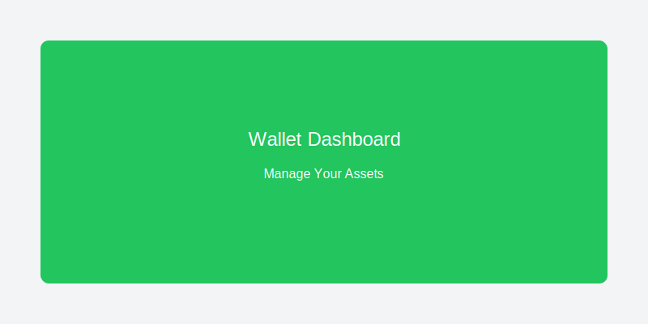

# Wallet Management

<div className="hero hero--primary">
  <div className="container">
    <h1 className="hero__title">💼 Wallet Management</h1>
    <p className="hero__subtitle">
      Complete guide to managing your Neo N3 wallets
    </p>
    <p>
      Master wallet operations, account management, and transaction handling in the NeoRust Desktop GUI.
    </p>
  </div>
</div>

## 🏠 Dashboard Overview

The wallet dashboard is your central hub for managing all Neo N3 assets and operations.



### **Key Components**

<div className="row">
  <div className="col col--4">
    <div className="card">
      <div className="card__header">
        <h3>💰 Portfolio Summary</h3>
      </div>
      <div className="card__body">
        <ul>
          <li>Total portfolio value</li>
          <li>Asset breakdown</li>
          <li>24h change indicators</li>
          <li>Real-time price updates</li>
        </ul>
      </div>
    </div>
  </div>
  
  <div className="col col--4">
    <div className="card">
      <div className="card__header">
        <h3>📊 Interactive Charts</h3>
      </div>
      <div className="card__body">
        <ul>
          <li>Price history graphs</li>
          <li>Portfolio allocation pie chart</li>
          <li>Performance metrics</li>
          <li>Customizable time ranges</li>
        </ul>
      </div>
    </div>
  </div>
  
  <div className="col col--4">
    <div className="card">
      <div className="card__header">
        <h3>📝 Recent Activity</h3>
      </div>
      <div className="card__body">
        <ul>
          <li>Latest transactions</li>
          <li>Status indicators</li>
          <li>Quick action buttons</li>
          <li>Transaction details</li>
        </ul>
      </div>
    </div>
  </div>
</div>

---

## 👤 Account Management

### **Creating New Accounts**

1. **Navigate to Accounts**: Click "Accounts" in the sidebar
2. **Add Account**: Click the "+" button or "Create New Account"
3. **Account Setup**:
   ```
   Account Name: "Trading Account"
   Account Type: Standard / Multi-signature
   Derivation Path: m/44'/888'/0'/0/1 (auto-generated)
   ```
4. **Confirm Creation**: Review details and click "Create Account"


### **Account Types**

<div className="row">
  <div className="col col--6">
    <h4>🔑 Standard Account</h4>
    <ul>
      <li><strong>Single signature</strong> required</li>
      <li><strong>Full control</strong> with private key</li>
      <li><strong>Quick transactions</strong></li>
      <li><strong>Best for</strong>: Personal use, trading</li>
    </ul>
  </div>
  <div className="col col--6">
    <h4>🔐 Multi-Signature Account</h4>
    <ul>
      <li><strong>Multiple signatures</strong> required</li>
      <li><strong>Enhanced security</strong> for large amounts</li>
      <li><strong>Shared control</strong> between parties</li>
      <li><strong>Best for</strong>: Business, joint accounts</li>
    </ul>
  </div>
</div>

### **Account Operations**

#### **Viewing Account Details**
```
Account Information:
├─ Address: NbTiM6h8r99kpRtb428XcsUk1TzKed2gTc
├─ Public Key: 03b4af8d061b6b320cce6c63bc4ec7894dce107bfc5f5ef5c68a93b4ad1e136816
├─ Balance: 150.00 NEO, 2,500.00 GAS
├─ Transactions: 47 total
└─ Created: 2024-01-15 14:30:22
```

#### **Account Actions**
- **🏷️ Rename Account**: Change display name
- **📋 Copy Address**: Copy to clipboard
- **🔍 View on Explorer**: Open in blockchain explorer
- **📤 Export Private Key**: Secure export (password required)
- **🗑️ Remove Account**: Delete from wallet (with confirmation)

---

## 💸 Sending Transactions

### **Basic Token Transfer**

1. **Select Account**: Choose sending account
2. **Choose Asset**: Select NEO, GAS, or custom token
3. **Enter Details**:
   ```
   Recipient: NX8GVjjjhyZNhMhmdBbg1KrP3tJ5cAqd2c
   Amount: 10.00000000
   Asset: NEO
   Network Fee: 0.00123456 GAS (auto-calculated)
   ```
4. **Review Transaction**: Verify all details
5. **Sign & Send**: Enter password and confirm


### **Advanced Transfer Options**

#### **Batch Transfers**
Send to multiple recipients in one transaction:

```
Recipients:
├─ NX8GVjjjhyZNhMhmdBbg1KrP3tJ5cAqd2c → 5.00 NEO
├─ NY9WpJ3qKyqK8gLbTKrP3tJ5cAqd2c → 3.00 NEO
└─ NZ1AbCdEfGhIjKlMnOpQrStUvWxYz2 → 2.00 NEO

Total: 10.00 NEO + 0.00456789 GAS (fees)
```

#### **Scheduled Transactions**
Set up recurring or delayed payments:

```
Schedule Configuration:
├─ Type: Recurring
├─ Frequency: Monthly
├─ Start Date: 2024-02-01
├─ End Date: 2024-12-31
└─ Amount: 100.00 GAS
```

### **Transaction Status Tracking**

<div className="row">
  <div className="col col--3">
    <div className="text--center">
      <h4>🟡 Pending</h4>
      <p>Waiting for network confirmation</p>
    </div>
  </div>
  <div className="col col--3">
    <div className="text--center">
      <h4>🔄 Confirming</h4>
      <p>Being processed by network</p>
    </div>
  </div>
  <div className="col col--3">
    <div className="text--center">
      <h4>✅ Confirmed</h4>
      <p>Successfully completed</p>
    </div>
  </div>
  <div className="col col--3">
    <div className="text--center">
      <h4>❌ Failed</h4>
      <p>Transaction rejected</p>
    </div>
  </div>
</div>

---

## 📥 Receiving Payments

### **Generate Receive Address**

1. **Select Account**: Choose receiving account
2. **Generate QR Code**: Click "Receive" button
3. **Share Information**:
   ```
   Address: NbTiM6h8r99kpRtb428XcsUk1TzKed2gTc
   QR Code: [Scannable QR code displayed]
   Network: Neo N3 MainNet
   ```


### **Payment Requests**

Create detailed payment requests with specific amounts:

```
Payment Request:
├─ Amount: 50.00 NEO
├─ Purpose: "Invoice #12345"
├─ Expiry: 24 hours
└─ QR Code: [Generated with embedded details]
```

### **Address Book Management**

#### **Adding Contacts**
```
Contact Information:
├─ Name: "John Doe"
├─ Address: NX8GVjjjhyZNhMhmdBbg1KrP3tJ5cAqd2c
├─ Label: "Business Partner"
├─ Notes: "Monthly payments"
└─ Verified: ✅ Address validated
```

#### **Contact Categories**
- **👥 Personal**: Friends and family
- **🏢 Business**: Professional contacts
- **🏦 Exchanges**: Trading platforms
- **🔧 Services**: DeFi protocols, dApps

---

## 📊 Transaction History

### **Advanced Filtering**

Filter transactions by multiple criteria:

```
Filter Options:
├─ Date Range: Last 30 days
├─ Transaction Type: All / Send / Receive / Contract
├─ Asset: All / NEO / GAS / Custom tokens
├─ Amount Range: 0.1 - 1000.0
├─ Status: All / Confirmed / Pending / Failed
└─ Account: All accounts / Specific account
```


### **Export Options**

Export transaction data for accounting or analysis:

<div className="row">
  <div className="col col--4">
    <div className="card">
      <div className="card__header">
        <h3>📄 CSV Export</h3>
      </div>
      <div className="card__body">
        <p>Spreadsheet-compatible format for accounting software.</p>
      </div>
    </div>
  </div>
  
  <div className="col col--4">
    <div className="card">
      <div className="card__header">
        <h3>📋 PDF Report</h3>
      </div>
      <div className="card__body">
        <p>Professional formatted report for documentation.</p>
      </div>
    </div>
  </div>
  
  <div className="col col--4">
    <div className="card">
      <div className="card__header">
        <h3>🔗 JSON Data</h3>
      </div>
      <div className="card__body">
        <p>Raw data format for custom analysis tools.</p>
      </div>
    </div>
  </div>
</div>

---

## 🔐 Security Features

### **Multi-Factor Authentication**

#### **Hardware Wallet Integration**
```
Ledger Device Setup:
├─ Device: Ledger Nano S Plus
├─ Status: Connected ✅
├─ App Version: Neo 1.0.3
├─ Accounts: 3 imported
└─ Security: PIN + Passphrase
```

#### **Biometric Authentication**
- **Fingerprint**: Quick unlock for frequent operations
- **Face ID**: Secure authentication on supported devices
- **PIN Code**: Backup authentication method

### **Transaction Security**

#### **Confirmation Requirements**
```
Security Levels:
├─ Low (< 1 NEO): Password only
├─ Medium (1-100 NEO): Password + 2FA
├─ High (> 100 NEO): Hardware wallet required
└─ Critical (> 1000 NEO): Multi-signature required
```

#### **Address Verification**
- **Checksum Validation**: Automatic address format checking
- **Known Address Warning**: Alerts for suspicious addresses
- **Whitelist Management**: Pre-approved recipient addresses

---

## 🔄 Backup and Recovery

### **Automated Backups**

Configure automatic wallet backups:

```
Backup Settings:
├─ Frequency: Daily
├─ Location: Encrypted cloud storage
├─ Retention: 30 days
├─ Encryption: AES-256
└─ Verification: Weekly integrity checks
```

### **Manual Backup Options**

<div className="row">
  <div className="col col--4">
    <div className="card">
      <div className="card__header">
        <h3>💾 Wallet File</h3>
      </div>
      <div className="card__body">
        <p>Complete wallet backup including all accounts and settings.</p>
        <ul>
          <li>Encrypted with password</li>
          <li>Includes transaction history</li>
          <li>Portable between devices</li>
        </ul>
      </div>
    </div>
  </div>
  
  <div className="col col--4">
    <div className="card">
      <div className="card__header">
        <h3>📝 Recovery Phrase</h3>
      </div>
      <div className="card__body">
        <p>12-word mnemonic phrase for wallet restoration.</p>
        <ul>
          <li>Works with any compatible wallet</li>
          <li>Recovers all derived accounts</li>
          <li>Store offline securely</li>
        </ul>
      </div>
    </div>
  </div>
  
  <div className="col col--4">
    <div className="card">
      <div className="card__header">
        <h3>🔑 Private Keys</h3>
      </div>
      <div className="card__body">
        <p>Individual account private keys for specific recovery.</p>
        <ul>
          <li>Account-specific recovery</li>
          <li>WIF format compatibility</li>
          <li>Maximum security control</li>
        </ul>
      </div>
    </div>
  </div>
</div>

### **Recovery Process**

#### **From Recovery Phrase**
1. **Import Wallet**: Click "Import Existing Wallet"
2. **Select Method**: Choose "Recovery Phrase"
3. **Enter Phrase**: Input 12-word recovery phrase
4. **Set Password**: Create new device password
5. **Restore**: Wait for account discovery and sync

#### **From Wallet File**
1. **Import Wallet**: Click "Import Existing Wallet"
2. **Select File**: Choose wallet backup file
3. **Enter Password**: Provide original wallet password
4. **Import**: Wallet restored with all accounts

---

## ⚙️ Advanced Settings

### **Network Configuration**

#### **Custom RPC Endpoints**
```
Network Settings:
├─ MainNet RPC: https://mainnet1.neo.coz.io:443
├─ TestNet RPC: https://testnet1.neo.coz.io:443
├─ Custom RPC: https://private-node.company.com:443
├─ Failover: Automatic switching enabled
└─ Health Check: Every 30 seconds
```

#### **Gas Price Management**
```
Fee Settings:
├─ Default: Auto-calculate optimal fee
├─ Economy: Lower fee, slower confirmation
├─ Standard: Balanced fee and speed
├─ Priority: Higher fee, faster confirmation
└─ Custom: Manual fee specification
```

### **Privacy Settings**

#### **Data Collection**
- **Analytics**: Anonymous usage statistics
- **Crash Reports**: Error reporting for improvements
- **Performance Metrics**: Speed and reliability data
- **Feature Usage**: Popular feature tracking

#### **Display Options**
- **Currency**: USD, EUR, BTC, NEO
- **Language**: Multiple language support
- **Theme**: Light, Dark, Auto
- **Notifications**: Transaction alerts, price updates

---

## 🎯 Best Practices

### **Security Recommendations**

<div className="row">
  <div className="col col--6">
    <h4>✅ Do This</h4>
    <ul>
      <li>Enable 2FA for all operations</li>
      <li>Use hardware wallets for large amounts</li>
      <li>Regularly backup your wallet</li>
      <li>Verify recipient addresses</li>
      <li>Keep software updated</li>
      <li>Use strong, unique passwords</li>
    </ul>
  </div>
  <div className="col col--6">
    <h4>❌ Avoid This</h4>
    <ul>
      <li>Sharing private keys or recovery phrases</li>
      <li>Using public WiFi for transactions</li>
      <li>Storing large amounts on hot wallets</li>
      <li>Ignoring security warnings</li>
      <li>Using weak passwords</li>
      <li>Skipping backup procedures</li>
    </ul>
  </div>
</div>

### **Performance Optimization**

#### **Transaction Efficiency**
- **Batch Operations**: Combine multiple transfers
- **Optimal Timing**: Send during low network congestion
- **Fee Management**: Use appropriate fee levels
- **UTXO Management**: Consolidate small inputs

#### **Wallet Maintenance**
- **Regular Cleanup**: Remove old transaction data
- **Index Rebuilding**: Refresh transaction indices
- **Cache Management**: Clear temporary data
- **Sync Optimization**: Efficient blockchain synchronization

---

## 🆘 Troubleshooting

### **Common Issues**

#### **Transaction Failures**
```
Error: Insufficient GAS for network fee
Solution: 
├─ Check GAS balance
├─ Reduce transaction amount
├─ Wait for network congestion to clear
└─ Use higher network fee
```

#### **Sync Problems**
```
Error: Wallet not synchronizing
Solution:
├─ Check internet connection
├─ Verify RPC endpoint status
├─ Restart application
├─ Clear cache and resync
└─ Switch to different RPC endpoint
```

#### **Account Access Issues**
```
Error: Cannot unlock account
Solution:
├─ Verify password correctness
├─ Check for caps lock
├─ Try password recovery
├─ Restore from backup
└─ Contact support if needed
```

### **Getting Help**

- **Built-in Help**: Press F1 or click Help menu
- **Documentation**: [Complete guides](https://neorust.netlify.app)
- **Community**: [GitHub Discussions](https://github.com/R3E-Network/NeoRust/discussions)
- **Support**: [Issue Tracker](https://github.com/R3E-Network/NeoRust/issues)

---

**Master your Neo N3 wallet management with confidence! 💪** 